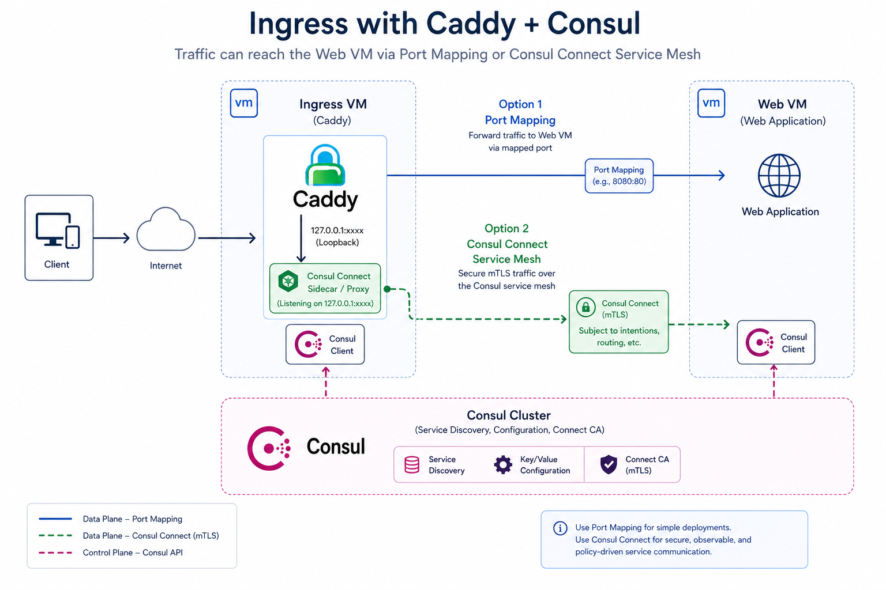

# Caddy Consul

Dynamic Caddy routing from Consul service registrations. Replaces Fabio as a single ingress layer by driving both HTTP and TCP/TLS routing directly from Consul service catalog and health data supporting traditional consul services and consul connect with intentions.

**NOTE: This Caddy plugin is NOT a storage engine for Caddy.**

## Features

- **Dynamic Discovery**: Watches Consul catalog and health APIs via blocking queries (not polling)
- **HTTP Routing**: Host-based, path-based, wildcard hosts, weighted upstreams, strip-prefix
- **TCP/TLS Routing**: Port-based, SNI-based, TLS passthrough via caddy-l4
- **Health-Aware**: Only routes to healthy upstreams (configurable policy)
- **Consul Connect**: Sidecar proxy integration via Agent API (sidecar mode only)
- **Fabio Compatible**: Supports `urlprefix-` tags for gradual migration
- **Zero-Restart**: All routing changes apply dynamically via Caddy Admin API
- **Conflict Detection**: Static config wins over Consul routes; first-seen wins among duplicates

## Architecture

The diagram below shows a simple ingress + web VM setup. Caddy runs on the ingress node, watching Consul for services. It routes HTTP traffic based on host/path and TCP traffic based on port/SNI. For Connect services, it manages Envoy sidecars for mTLS and intention enforcement.

Note that this same architecture can be deployed with Nomad, where Caddy Consul runs as a `Service` job on each Nomad node, handling HTTP/TLS termination and routing for all services on that node.



## Installation

### Building with xcaddy

```bash
xcaddy build \
    --with github.com/honest-hosting/caddy-consul \
    --with github.com/mholt/caddy-l4@...
```

## Configuration

### Configuration Options

| Option | Description | Default |
|--------|-------------|---------|
| `address` | Consul HTTP API address | `127.0.0.1:8500` |
| `token` | Consul ACL token | _(empty)_ |
| `scheme` | Consul API scheme (`http` or `https`) | `http` |
| `datacenter` | Consul datacenter | _(empty, uses agent default)_ |
| `tls_ca` | Path to CA certificate for Consul TLS | _(empty)_ |
| `tls_cert` | Path to client certificate for Consul TLS | _(empty)_ |
| `tls_key` | Path to client key for Consul TLS | _(empty)_ |
| `insecure_skip_verify` | Skip TLS verification for Consul connection | `false` |
| `service_proxy_enable` | Enable service discovery and direct routing | `true` |
| `health_policy` | Health check policy: `passing`, `warning`, `any` | `passing` |
| `conflict_policy` | Route conflict policy: `reject`, `first-wins` | `reject` |
| `connect_proxy_enable` | Enable Connect sidecar proxy routing | `false` |
| `connect_service_name` | Caddy's service identity in the mesh | `<hostname>-caddy-consul` |
| `connect_auto_register` | Auto-register Caddy in Consul on startup | `true` |
| `poll_interval` | Delay between sequential health queries during initial load/sync | `50ms` |
| `full_sync_interval` | How often to re-fetch all services (catches metadata changes) | `5m` |
| `debounce` | Debounce window for rapid Consul changes | `500ms` |
| `service_tag` | Sentinel tag for service proxy discovery | `caddy-consul` |
| `connect_tag` | Sentinel tag for connect proxy discovery | `caddy-consul-connect` |
| `connect_port_range_start` | Start of port range for dynamic sidecar upstreams | `19000` |
| `connect_port_range_end` | End of port range for dynamic sidecar upstreams | `29000` |
| `caddy_admin_api` | Caddy admin API address for TCP route reconciliation | `localhost:2019` |
| `data_dir` | Directory for runtime state (persisted across reloads) | `$XDG_DATA_HOME/caddy/caddy-consul` |
| `metrics` | Admin API path for Prometheus metrics | _(empty, disabled)_ |
| `l4_mode` | Layer 4 routing mode: `global` or `node` | `global` |
| `l4_node_hostname` | Explicit Consul node name override for `l4_mode=node` | _(auto-detected from agent)_ |
| `no_cache_status` | Status codes that trigger no-cache headers (`Cache-Control: no-cache, no-store, must-revalidate`, `Pragma: no-cache`, `Expires: 0`) on responses. Accepts class wildcards (`3xx`, `4xx`, `5xx`) and individual codes (`502`, `503`). Case-insensitive. | _(empty, no modification)_ |

Environment variables `CONSUL_HTTP_ADDR`, `CONSUL_HTTP_TOKEN`, `CONSUL_HTTP_SSL`, `CONSUL_CACERT`, `CONSUL_CLIENT_CERT`, and `CONSUL_CLIENT_KEY` are supported as fallbacks when the corresponding option is not set.

### Quick Start

Minimal configuration:

```caddyfile
{
    admin localhost:2019

    consul {
        address 127.0.0.1:8500
    }
}

:443 {
    consul_proxy
}
```

**Note:** The `consul_proxy` handler must be added to your server block. It dynamically routes HTTP requests based on Consul service discovery. Static routes defined before `consul_proxy` take precedence. The Caddy admin API is only needed for TCP/L4 route management.

### Complete Caddyfile Example

```caddyfile
{
    # Admin API required for caddy-consul
    admin localhost:2019

    consul {
        # Consul connection
        address 127.0.0.1:8500
        token {env.CONSUL_HTTP_TOKEN}
        scheme https
        datacenter dc1

        # TLS to Consul
        tls_ca /etc/consul/ca.pem
        tls_cert /etc/consul/cert.pem
        tls_key /etc/consul/key.pem

        # Skip TLS verification for Consul connection (default: false)
        insecure_skip_verify false

        # Enable service proxy (default: true). Set to false to disable service discovery.
        service_proxy_enable true

        # Health policy: "passing" (default), "warning", "any"
        health_policy passing

        # Conflict policy: "reject" (default), "first-wins"
        conflict_policy reject

        # Enable connect proxy via sidecar (default: false)
        connect_proxy_enable false

        # Caddy's service identity in the mesh (default: <hostname>-caddy-consul)
        connect_service_name my-ingress

        # Auto-register Caddy as a service in Consul on startup (default: true)
        connect_auto_register true

        # Max concurrent Consul health check queries (default: 5)
        max_concurrent_checks 5

        # Debounce window for rapid Consul changes (default: 500ms)
        debounce 500ms

        # Layer 4 mode: "global" (default) or "node"
        # In "node" mode, TCP/L4 routes are only created for services with
        # at least one healthy instance on the local Consul node
        l4_mode global

        # Explicit node name override for l4_mode=node (default: auto-detected from Consul agent)
        # l4_node_hostname worker-03.dc1

        # Set no-cache headers (Cache-Control: no-cache, no-store, must-revalidate;
        # Pragma: no-cache; Expires: 0) on responses matching these status codes.
        # Accepts class wildcards (3xx, 4xx, 5xx) and individual codes (502, 503).
        # Default: empty (no modification — upstream Cache-Control headers pass through as-is).
        # Per-service override via caddy-no-cache-status metadata.
        no_cache_status 3xx,4xx,5xx

        # Enable metrics on admin API (optional)
        metrics /metrics/consul
    }
}

:443 {
    # Static routes defined here always win over Consul-discovered routes
    @admin host admin.internal
    handle @admin {
        reverse_proxy localhost:9090
    }

    # Consul dynamic routing (catch-all for all other hosts)
    consul_proxy
}
```

### Complete Caddy JSON Example

The JSON field names match the Caddyfile directive names. The consul config lives under `apps.consul`:

```json
{
  "admin": {
    "listen": "localhost:2019"
  },
  "apps": {
    "consul": {
      "address": "127.0.0.1:8500",
      "token": "",
      "scheme": "https",
      "datacenter": "dc1",
      "tls_ca": "/etc/consul/ca.pem",
      "tls_cert": "/etc/consul/cert.pem",
      "tls_key": "/etc/consul/key.pem",
      "insecure_skip_verify": false,
      "service_proxy_enable": true,
      "health_policy": "passing",
      "conflict_policy": "reject",
      "connect_proxy_enable": false,
      "connect_service_name": "my-ingress",
      "connect_auto_register": true,
      "poll_interval": "50ms",
      "full_sync_interval": "5m",
      "debounce_duration": "500ms",
      "service_tag": "caddy-consul",
      "connect_tag": "caddy-consul-connect",
      "caddy_admin_api": "localhost:2019",
      "data_dir": "/var/lib/caddy-consul",
      "metrics": "/metrics/consul",
      "l4_mode": "global",
      "l4_node_hostname": "",
      "no_cache_status": "3xx,4xx,5xx"
    },
    "http": {
      "servers": {
        "srv0": {
          "listen": [":443"],
          "routes": [
            {
              "handle": [{"handler": "consul_proxy"}]
            }
          ]
        }
      }
    }
  }
}
```

## Consul Service Configuration

Services declare routing instructions via Consul service metadata or tags.

### Service Discovery Tags

Services using metadata-based routing (not Fabio `urlprefix-` tags) **must** include a sentinel tag in their service registration. This tag tells caddy-consul to inspect the service's metadata for routing configuration. Without it, the service will be skipped during catalog discovery.

| Tag | Purpose | Default |
|-----|---------|---------|
| `caddy-consul` | Standard service proxy routing | Configurable via `service_tag` |
| `caddy-consul-connect` | Connect mesh service routing | Configurable via `connect_tag` |

**Standard service** (direct routing):
```json
{
    "service": {
        "name": "my-app",
        "port": 8080,
        "tags": ["caddy-consul"],
        "meta": {
            "caddy-host": "app.example.com"
        }
    }
}
```

**Connect service** (sidecar routing):
```json
{
    "service": {
        "name": "my-mesh-app",
        "port": 8080,
        "tags": ["caddy-consul-connect"],
        "meta": {
            "caddy-host": "mesh-app.example.com"
        },
        "connect": {
            "sidecar_service": {}
        }
    }
}
```

Services using Fabio-compatible `urlprefix-` tags do NOT need sentinel tags — they are detected automatically.

### Metadata Format (Preferred)

| Key | Description | Default |
|-----|-------------|---------|
| `caddy-protocol` | `http`, `https`, `tcp`, `tls-passthrough` | `http` |
| `caddy-host` | Hostname for HTTP routing or SNI for TLS | _(required for HTTP)_ |
| `caddy-path` | HTTP path prefix | `/` |
| `caddy-port` | TCP listener port | _(required for TCP)_ |
| `caddy-priority` | Route priority (higher wins) | `0` |
| `caddy-weight` | Upstream weight | `1` |
| `caddy-strip-prefix` | Strip path prefix before forwarding (`true`/`false`) | `false` |
| `caddy-redirect-code` | HTTP redirect status code (301, 302, etc.) | _(empty = proxy)_ |
| `caddy-redirect-url` | Redirect target URL (may use `{http.request.uri}`) | _(empty = proxy)_ |
| `caddy-redirect-no-cache` | If `true`, send no-cache headers (`Cache-Control: no-cache, no-store, must-revalidate`, `Pragma: no-cache`, `Expires: 0`) on redirect responses. Applies only to redirect routes. | `false` |
| `caddy-enabled` | Enable/disable route (`true`/`false`) | `true` |
| `caddy-no-cache-status` | Per-service override for `no_cache_status`. Overrides the global setting entirely. Empty value (`""`) opts out of no-cache header modification. | _(uses global setting)_ |

#### Example: HTTP Redirect

```json
{
    "service": {
        "name": "old-domain",
        "port": 8080,
        "meta": {
            "caddy-host": "old.example.com",
            "caddy-redirect-code": "301",
            "caddy-redirect-url": "https://new.example.com{http.request.uri}"
        }
    }
}
```

Redirect routes return an HTTP redirect response instead of proxying. They work in both service and connect proxy modes. The `{http.request.uri}` placeholder preserves the original request path.

To prevent browsers and CDNs from caching a redirect (useful for redirects that may change), add `caddy-redirect-no-cache: "true"`. This sends `Cache-Control: no-cache, no-store, must-revalidate`, `Pragma: no-cache`, and `Expires: 0` alongside the `Location` header:

```json
{
    "service": {
        "name": "rotating-redirect",
        "port": 8080,
        "meta": {
            "caddy-host": "promo.example.com",
            "caddy-redirect-code": "302",
            "caddy-redirect-url": "https://promo-target.example.com{http.request.uri}",
            "caddy-redirect-no-cache": "true"
        }
    }
}
```

This setting only applies to redirect routes; for non-redirect responses, use `caddy-no-cache-status` instead. For multi-route services, use the indexed variant: `caddy-route-N-redirect-no-cache`.

#### Example: No-Cache Response Headers

The `no_cache_status` option (global) and `caddy-no-cache-status` metadata (per-service) control automatic injection of no-cache headers (`Cache-Control: no-cache, no-store, must-revalidate`, `Pragma: no-cache`, `Expires: 0`) on responses matching specific status codes. This prevents browsers and CDNs from caching error responses. (For redirect responses specifically, use `caddy-redirect-no-cache` — `caddy-no-cache-status` does not apply to redirect routes.)

**Global config** — applies to all services unless overridden:

```caddyfile
consul {
    no_cache_status 3xx,4xx,5xx
}
```

**Per-service override** — replaces the global setting for this service only:

```json
{
    "service": {
        "name": "my-api",
        "port": 8080,
        "tags": ["caddy-consul"],
        "meta": {
            "caddy-host": "api.example.com",
            "caddy-no-cache-status": "502,503"
        }
    }
}
```

**Per-service opt-out** — disables no-cache header modification even when global is set:

```json
{
    "service": {
        "name": "my-cdn-app",
        "port": 8080,
        "tags": ["caddy-consul"],
        "meta": {
            "caddy-host": "cdn.example.com",
            "caddy-no-cache-status": ""
        }
    }
}
```

**Precedence:**
1. Per-service metadata present with value → use that value
2. Per-service metadata present but empty (`""`) → no modification (opt-out)
3. Per-service metadata absent → use global `no_cache_status`
4. Global unset → no modification (upstream Cache-Control passes through)

**Accepted formats:** `3xx`, `3XX`, `301`, `4xx,502,503` (comma-separated, case-insensitive wildcards).

For multi-route services, use the indexed variant: `caddy-route-N-no-cache-status`.

#### Example: Consul Service Tags

Routing can also be configured via Consul service tags (useful for Nomad job definitions or `consul services register` CLI):

```json
{
    "service": {
        "name": "web-app",
        "port": 8080,
        "tags": [
            "urlprefix-app.example.com/"
        ]
    }
}
```

```json
{
    "service": {
        "name": "old-domain",
        "port": 8080,
        "tags": [
            "urlprefix-old.example.com/ redirect=301,https://new.example.com$path"
        ]
    }
}
```

Service metadata (`meta`) and Fabio-compatible tags (`urlprefix-`) can be used interchangeably. Metadata takes precedence if both are present.

#### Example: Simple HTTP Service

```json
{
    "service": {
        "name": "web-app",
        "port": 8080,
        "meta": {
            "caddy-host": "app.example.com",
            "caddy-path": "/",
            "caddy-protocol": "http"
        }
    }
}
```

### Multi-Route Metadata

For services that need multiple routes, use indexed keys:

```json
{
    "meta": {
        "caddy-route-0-protocol": "http",
        "caddy-route-0-host": "app.example.com",
        "caddy-route-0-path": "/api",
        "caddy-route-1-protocol": "tcp",
        "caddy-route-1-port": "5432"
    }
}
```

If both indexed (`caddy-route-N-*`) and non-indexed (`caddy-*`) keys exist, indexed keys take precedence.

### Fabio-Compatible Tags

For migration from Fabio, `urlprefix-` tags are supported:

```
urlprefix-app.example.com/
urlprefix-app.example.com/api strip=/api
urlprefix-:5432 proto=tcp
urlprefix-secure.example.com/ proto=https
urlprefix-old.example.com/ redirect=301,https://new.example.com$path
```

**Supported modifiers:**
- `proto=http|https|tcp` (default: `http`)
- `strip=<path>` (strip path prefix)
- `redirect=<code>,<url>` (HTTP redirect; `$path` expands to request URI)

**Port handling:** Standard ports (`:80`, `:443`) in the host are stripped automatically (e.g., `urlprefix-host:80/` matches on `host`). Caddy's automatic HTTPS handles HTTP→HTTPS redirects.

If both metadata and Fabio tags exist, metadata takes precedence.

## Architecture

### How `consul_proxy` works

HTTP routing uses an in-memory route table — **no Caddy config reloads** for HTTP route changes:

1. The `consul` app watches Consul for service changes using **2 blocking queries** (catalog + health state)
2. On change, routes are compiled and the in-memory route table is updated
3. The `consul_proxy` HTTP handler matches each request against the route table at request time
4. Static routes defined in your Caddyfile run first (before `consul_proxy`) and always win

TCP routing uses the Caddy admin API to create L4 servers (since new TCP listener ports require config changes). TCP state is persisted across reloads to prevent cascading reload cycles.

### Scaling

The watcher uses only 2 Consul connections regardless of service count:
- **Catalog watcher**: blocking query on `/v1/catalog/services` — detects service add/remove
- **Health state watcher**: blocking query on `/v1/health/state/passing` — detects health changes across ALL services

Health changes (node failure, instance recovery) update cached state locally — **zero extra Consul queries**. New services get a single targeted health fetch. A periodic full sync (`full_sync_interval`) catches metadata changes.

| Scale | Connections | Cold start time | Health change detection |
|-------|-------------|----------------|----------------------|
| 50 services | 2 | ~2.5s | Instant |
| 1,000 services | 2 | ~50s | Instant |
| 10,000 services | 2 | ~8min (routes from disk instantly) | Instant |

### Admin API endpoints

- `GET /consul/metrics` — Prometheus metrics (if enabled)
- `GET /consul/state` — JSON dump of current state
- `GET /consul/routes` — JSON dump of in-memory HTTP route table

## Routing

### HTTP Routing

The `consul_proxy` handler dynamically routes HTTP requests based on Consul service discovery:
- Host-based and path-based matching
- Wildcard hosts (`*.example.com`)
- Longest path prefix wins
- Automatic upstream load balancing
- WebSocket support
- Strip-prefix rewrite
- HTTP redirects

### TCP Routing

TCP routes automatically create L4 (caddy-l4) servers:
- `urlprefix-:5432 proto=tcp` creates a listener on port 5432
- Multiple services on the same port are disambiguated by SNI matching
- TLS passthrough forwards encrypted traffic without termination

#### L4 Mode

The `l4_mode` option controls how TCP/TLS-passthrough routes are materialized:

| Mode | Behavior |
|------|----------|
| `global` (default) | All TCP/L4 routes are created regardless of which node Caddy runs on |
| `node` | TCP/L4 routes are only created when at least one healthy upstream runs on the same Consul node as Caddy |

In `node` mode, the plugin resolves the local Consul node name automatically from the agent. Use `l4_node_hostname` to override this with an explicit node name (useful when Caddy's hostname doesn't match the Consul node name).

HTTP/HTTPS routes are unaffected by `l4_mode` and always pass through regardless of the setting.

### Service Proxy

The `service_proxy_enable` option controls whether Consul service discovery and routing is active (default: `true`). Set to `false` to disable service discovery entirely — no watcher, no routes.

### Connect Proxy (Service Mesh)

By default, Connect proxy is disabled (`connect_proxy_enable false`). Set `connect_proxy_enable true` to enable Consul Connect service mesh integration. caddy-consul will automatically manage Envoy sidecar upstream configuration — no manual upstream setup needed.

**Mixed mode is fully supported**: services using direct routing (`caddy-consul` tag) and services using mesh routing (`caddy-consul-connect` tag) coexist in the same Caddy instance.

#### How it works

```
Client → Caddy (TLS termination) → localhost:<port> → Envoy sidecar → mTLS → upstream service
```

1. caddy-consul discovers services tagged `caddy-consul-connect`
2. For each Connect service, caddy-consul **automatically allocates a local port** and registers it as an upstream in Consul
3. Envoy detects the change via xDS and opens a local listener on that port
4. caddy-consul's `SidecarResolver` discovers the bind port and routes traffic through it
5. Envoy handles mTLS, certificate rotation, and intention enforcement

#### Running the Envoy sidecar

The Envoy sidecar must be running alongside Caddy. Start it with:

```bash
consul connect envoy \
  -sidecar-for <connect_service_name> \
  -http-addr <consul_addr> \
  -token <consul_token>
```

Example:
```bash
consul connect envoy \
  -sidecar-for my-ingress \
  -http-addr http://127.0.0.1:8500 \
  -token "$CONSUL_HTTP_TOKEN"
```

**Prerequisites:**
- `consul` binary in PATH
- `envoy` binary in PATH (install via `func-e use <version>`)
- ACL token with `service:write` for `connect_service_name`
- Local Consul agent running

The sidecar is **stateless** — Consul is the source of truth. On restart, it re-bootstraps automatically. caddy-consul manages the upstream configuration dynamically via the Consul API; Envoy picks up changes via xDS without restart.

#### Dynamic upstream management

caddy-consul automatically manages Envoy's upstream list:
- **New Connect service discovered** → port allocated, upstream added to Consul registration, Envoy opens listener
- **Connect service removed** → upstream removed, Envoy closes listener, port freed
- **Port range**: configurable via `connect_port_range_start` / `connect_port_range_end` (default: 19000-29000, supports 10,000 services)
- **Port allocation**: deterministic hash-based, stable across restarts (persisted to state file)

#### Connect Identity

Caddy's identity in the mesh is set by `connect_service_name` (default: `<hostname>-caddy-consul`). This is used for:
- Sidecar proxy registration
- Upstream management
- Intention rules (source identity)

Intentions are written as: `ALLOW <connect_service_name> → <upstream-service>`

## Health-Aware Routing

| Policy | Behavior |
|--------|----------|
| `passing` (default) | Only route to instances where all checks pass |
| `warning` | Include instances with warning-level checks |
| `any` | Include all registered instances regardless of health |

When no healthy upstreams remain for a service, the route is removed until health recovers.

## Conflict Resolution

1. **Static Caddy config always wins** — routes defined in your Caddyfile are never overwritten by Consul-discovered routes. A WARN log is emitted for the discarded Consul route.
2. **Among Consul routes, first-seen wins** — determined by alphabetical service name order for consistency. A WARN log is emitted for the duplicate.
3. **Priority tiebreaker** — if services set `caddy-priority`, higher values win before falling back to first-seen.

## Monitoring

### Prometheus Metrics

When metrics are enabled (`metrics /metrics/consul`):

| Metric | Type | Description |
|--------|------|-------------|
| `caddy_consul_services_total` | Gauge | Number of watched services |
| `caddy_consul_routes_total` | Gauge | Active routes by protocol |
| `caddy_consul_upstreams_healthy` | Gauge | Healthy upstreams per service |
| `caddy_consul_upstreams_total` | Gauge | Total upstreams per service |
| `caddy_consul_reconcile_duration_seconds` | Histogram | Reconciliation timing |
| `caddy_consul_reconcile_errors_total` | Counter | Reconciliation failures |
| `caddy_consul_watcher_errors_total` | Counter | Consul watch errors |
| `caddy_consul_conflicts_total` | Counter | Route conflicts by type |
| `caddy_consul_debounce_events_total` | Counter | Debounce flush events |

### Admin API Endpoints

Available when Caddy admin API is enabled:

- `GET /consul/metrics` — Prometheus metrics
- `GET /consul/state` — JSON dump of current routing state

### Prometheus Scrape Configuration

```yaml
scrape_configs:
  - job_name: 'caddy_consul'
    static_configs:
      - targets: ['localhost:2019']
    metrics_path: /consul/metrics
```

## Migration from Fabio

### Service Discovery Requirements

caddy-consul discovers services based on Consul service **tags**. A service must have at least one of the following tags to be discovered:

| Tag | When to use |
|-----|-------------|
| `urlprefix-*` | Fabio-compatible services (auto-detected) |
| `caddy-consul` | Services using `caddy-*` metadata for routing |

Services with neither tag are skipped during catalog discovery. This keeps the health check load proportional to routable services, not total services in the cluster.

### Tag Mapping

| Fabio Tag | caddy-consul Equivalent (tag + metadata) |
|-----------|------------------------|
| `urlprefix-host.com/` | tag: `caddy-consul`, meta: `caddy-host=host.com` |
| `urlprefix-host.com/path` | tag: `caddy-consul`, meta: `caddy-host=host.com`, `caddy-path=/path` |
| `urlprefix-host.com/api strip=/api` | tag: `caddy-consul`, meta: `caddy-host=host.com`, `caddy-path=/api`, `caddy-strip-prefix=true` |
| `urlprefix-:5432 proto=tcp` | tag: `caddy-consul`, meta: `caddy-protocol=tcp`, `caddy-port=5432` |
| `urlprefix-old.com/ redirect=301,https://new.com$path` | tag: `caddy-consul`, meta: `caddy-host=old.com`, `caddy-redirect-code=301`, `caddy-redirect-url=https://new.com{http.request.uri}` |

### Migration Steps

1. Deploy Caddy with `caddy-consul` alongside Fabio
2. Services already using `urlprefix-` tags will be discovered automatically — no changes needed
3. Gradually migrate services to `caddy-*` metadata:
   - Add the `caddy-consul` tag to the service registration
   - Add `caddy-*` metadata keys for routing configuration
   - Keep `urlprefix-` tags during transition (caddy-consul prefers metadata when both exist)
4. Verify traffic flows through Caddy correctly
5. Remove `urlprefix-` tags from migrated services
6. Once all traffic flows through Caddy, decommission Fabio

## Consul ACL Permissions

caddy-consul requires a Consul ACL token with the following permissions. The exact set depends on which features you use.

### Required (all deployments)

| Resource | Permission | API Endpoint | Purpose |
|----------|-----------|--------------|---------|
| `service_prefix ""` | `read` | `/v1/catalog/services` | Watch the service catalog for changes |
| `node_prefix ""` | `read` | `/v1/health/service/<name>` | Watch service health and read node addresses |
| `service_prefix ""` | `read` | `/v1/health/service/<name>` | Read service instances, tags, metadata |

### Required for Connect (sidecar mode)

| Resource | Permission | API Endpoint | Purpose |
|----------|-----------|--------------|---------|
| `service "<connect_service_name>"` | `read` | `/v1/agent/service/<name>-sidecar-proxy` | Read Caddy's sidecar proxy config and upstream bind ports |

### Required for auto-registration (`connect_auto_register true`)

| Resource | Permission | API Endpoint | Purpose |
|----------|-----------|--------------|---------|
| `service "<connect_service_name>"` | `write` | `/v1/agent/service/register` | Register Caddy as a service with Connect sidecar |
| `service "<connect_service_name>-sidecar-proxy"` | `write` | `/v1/agent/service/register` | Register the sidecar proxy service |

### Minimal policy (no Connect)

```hcl
service_prefix "" {
  policy = "read"
}

node_prefix "" {
  policy = "read"
}
```

### Full policy (with Connect + auto-registration)

```hcl
service_prefix "" {
  policy = "read"
}

node_prefix "" {
  policy = "read"
}

# Replace "my-ingress" with your connect_service_name
service "my-ingress" {
  policy = "write"
}

service "my-ingress-sidecar-proxy" {
  policy = "write"
}
```

### Creating the token

```bash
# Create the policy
consul acl policy create \
  -name caddy-consul \
  -rules @caddy-consul-policy.hcl

# Create the token
consul acl token create \
  -description "caddy-consul plugin" \
  -policy-name caddy-consul
```

## Troubleshooting

### Routes not appearing?
1. Check Caddy logs for parse errors or conflicts
2. Verify the service has `caddy-*` metadata or `urlprefix-` tags
3. Ensure the service has at least one healthy instance
4. Check the admin API: `curl http://localhost:2019/consul/state`

### Caddy won't start?
1. Ensure `admin` is not set to `off` — caddy-consul requires the admin API
2. Check Consul connectivity: `curl http://127.0.0.1:8500/v1/status/leader`

### Stale routes after Consul changes?
1. Check the debounce duration — changes are batched within the debounce window
2. Look for WARN logs about debounce enter/exit timing
3. Reduce `debounce` if convergence is too slow

### Duplicate route warnings?
This is expected when two services claim the same host/path or port/SNI. The first-seen service wins. Check WARN logs for details on which service was discarded.

### Connect sidecar routes not working?
1. Verify Caddy's service is registered in Consul: `consul catalog services | grep <connect_service_name>`
2. Check the sidecar has upstream entries for the target service: `consul connect proxy-config <connect_service_name>-sidecar-proxy`
3. Verify intentions allow the connection: `consul intention check <connect_service_name> <target-service>`
4. Check Caddy logs for `no upstream entry for service` warnings

## License

MIT License
